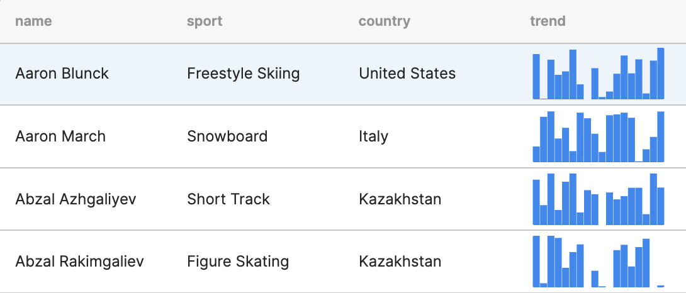

# Sparkchart

A tiny Cloudflare Worker service that creates small SVG charts.

It can be useful in no-code / low-code tools to add tiny charts in tables or similar views.



### Base URL

```
https://sparkchart.presenta.workers.dev/
```

### Chart types

```
/bars
/line
/area
/dots (experimental)
```

### Parameters

**Data**: numbers comma separated

```
?data=2,5,8,23
```

**Color**: any CSS color value

```
?color=red
```

**Spline** option for Area and Line only

```
?spline=true
```


### Examples

```
https://sparkchart.presenta.workers.dev/bars?data=23,4,54,6,34,3&color=orange
```


```
https://sparkchart.presenta.workers.dev/line?data=23,4,54,6,34,3&color=steelblue&spline=true
```


```
https://sparkchart.presenta.workers.dev/area?data=23,4,54,6,34,3&color=red
```


